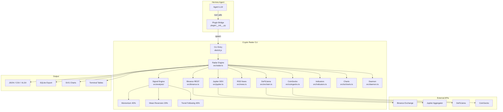
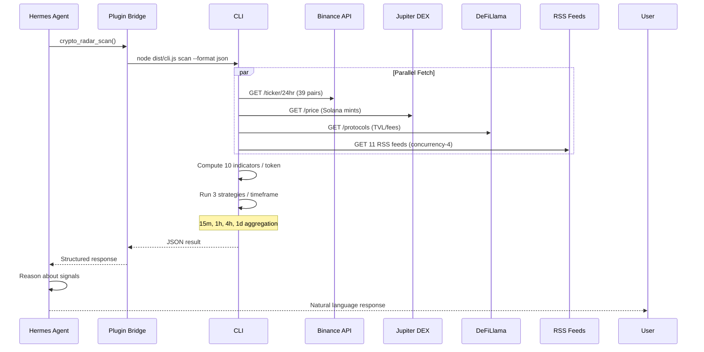
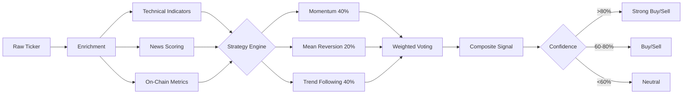

<p align="center">
  <br>
  <a href="https://github.com/ssdeanx/Hermes-Crypto-Radar/actions/workflows/ci.yml"></a>
  <a href="https://github.com/ssdeanx/Hermes-Crypto-Radar/actions/workflows/nightly-e2e.yml"></a>
  <a href="https://www.npmjs.com/package/hermes-crypto-radar"></a>
  <a href="LICENSE"></a>
  
  
</p>

<h1 align="center">🛰️ Hermes Crypto Radar</h1>
<p align="center"><strong>Enterprise-grade multi-chain crypto market intelligence — Hermes Agent plugin</strong></p>
<p align="center">Track 39+ tokens across 8 chains with 10 technical indicators, a 3-strategy signal engine, DeFiLlama on-chain metrics, RSS news aggregation, and rich SVG charts. Built for Hermes Agent with a warm daemon for sub-50ms tool calls.</p>

<p align="center">
  <a href="#-features">Features</a> •
  <a href="#-architecture--data-flow">Architecture & Data Flow</a> •
  <a href="#-quick-install">Quick Install</a> •
  <a href="#-cli-reference">CLI Reference</a> •
  <a href="#-hermes-plugin-tools">Plugin Tools</a> •
  <a href="#-development">Development</a> •
  <a href="SPEC.md">SPEC</a> •
  <a href="CHANGELOG.md">Changelog</a>
</p>

---

## ✨ Features

| Area | Highlights |
|------|-----------|
| **🪙 Token Coverage** | 39+ tokens across 8 chains — Solana, Polygon, Ethereum, BNB, Bitcoin, XRP, Cardano, Dogecoin, Cosmos, Sui, Aptos, Sei, Celestia, Injective, Thorchain |
| **📊 Technical Indicators** | **10 indicators**: RSI (14), MACD (12/26/9), Bollinger Bands (20/2), ATR (14), MFI (14), OBV, Stochastic (%K/%D), Ichimoku Cloud, Williams %R, CMF, TSI |
| **🧠 Signal Engine** | 3 strategies: Momentum (40%), Mean Reversion (20%), Trend Following (40%) — weighted voting with confidence scoring |
| **⏱️ Multi-Timeframe** | Parallel kline fetch across 15m, 1h, 4h, 1d intervals with weighted aggregation |
| **⛓️ On-Chain Metrics** | DeFiLlama integration — protocol TVL, chain TVL, fees (1d/7d/30d) — boosts signal confidence |
| **📰 News Aggregation** | 9 RSS feeds with relevance scoring, dedup, poison-filtering via token headline/body matching |
| **🎯 Dynamic Scan** | `--dynamic` flag auto-detects top N tokens by 24h volume (default: 50) |
| **📈 Charts** | SVG candlestick, line, multi-panel dashboards with CSS gradients, tooltips, crosshairs, responsive viewBox, accessibility |
| **💾 Export** | JSON, CSV, Markdown, terminal table, **XLSX** (Excel/Sheets with frozen headers + conditional formatting) |
| **🥇 Daemon Mode** | Warm HTTP daemon for sub-50ms tool calls, configurable cache refresh |
| **🛡️ Enterprise** | Circuit breaker (CLOSED/OPEN/HALF-OPEN), token-bucket rate limiter, TTL cache, atomic writes, log rotation (10MB → gzip), typed error classes |
| **⚙️ Configurable** | `radar.config.json` + `RADAR__*` env vars — strategy weights, timeframe weights, token whitelist, log level, data dir |
| **🔌 Hermes Plugin** | 8 agent tools returning structured JSON for agent reasoning |
| **📁 Data Directory** | Standardized to `~/.hermes/data/crypto-radar/` — logs, rotation, cross-session persistence |

> **Requirements:** Node.js >= 22, Hermes Agent (for plugin integration). No API keys required — uses public Binance REST API + RSS feeds + DeFiLlama (free).

---

## 🏗 Architecture & Data Flow

### System Context Diagram



### Scan Pipeline — Data Flow



### Signal Pipeline



### Project Structure

```
hermes-crypto-radar/
├── src/
│   ├── cli.ts              # CLI entry (Commander.js)
│   ├── index.ts            # Public API exports
│   ├── types.ts            # Type definitions
│   ├── tokens.ts           # Token registry (39+ tokens)
│   ├── binance.ts          # Binance REST client (ticker + klines)
│   ├── coingecko.ts        # CoinGecko fallback price source
│   ├── indicators.ts       # 10 technical indicators (RSI, MACD, BB, ATR, MFI, OBV,
│   │                       #   Stochastic, Ichimoku, Williams %R, CMF, TSI)
│   ├── onchain.ts          # DeFiLlama integration (TVL, fees, prices)
│   ├── news.ts             # RSS news fetcher + relevance matcher
│   ├── signals.ts          # Composite signal scoring + on-chain boost
│   ├── output.ts           # Formatters (table, JSON, CSV, MD)
│   ├── xlsx-export.ts      # Excel export via exceljs
│   ├── radar.ts            # Main enrichment pipeline
│   ├── daemon.ts           # Warm daemon for sub-50ms tool calls
│   ├── core/               # Enterprise infrastructure
│   │   ├── config.ts       # Typed config (file + env + defaults)
│   │   ├── errors.ts       # 6 typed error classes
│   │   ├── cache.ts        # TTL-based in-memory cache
│   │   ├── rate-limiter.ts # Token-bucket rate limiter
│   │   ├── logger.ts       # Structured JSON logger (6 levels)
│   │   ├── circuit-breaker.ts # CLOSED/OPEN/HALF-OPEN states
│   │   └── log-rotation.ts # Rotate at 10MB, gzip, keep 5
│   ├── analysis/           # Strategy signal engine
│   │   ├── strategies.ts   # Strategy interface + types
│   │   ├── engine.ts       # Weighted voting engine + config overrides
│   │   ├── momentum.ts     # Momentum strategy (40%)
│   │   ├── mean-reversion.ts # Mean reversion (20%)
│   │   └── trend-following.ts # Trend following (40%)
│   ├── io/                 # Visual output
│   │   └── charts.ts       # ASCII sparklines + SVG charts (line, candlestick, dashboard)
│   └── monitor/            # System health
│       └── health.ts       # Health checks (API, data, system)
├── plugin/
│   ├── __init__.py         # Hermes plugin Python bridge
│   └── plugin.yaml         # Plugin metadata
├── data/                   # Log output directory
├── .github/workflows/      # CI pipeline (Node 20 & 22)
├── SPEC.md                 # Full specification
├── CHANGELOG.md            # Release history
├── CRYPTO-ENTERPRISE-AUDIT.md  # Enterprise audit
├── .env.example            # Environment config template
└── package.json
```

---

## 📦 Marketplace Installation

### From Hermes Marketplace (recommended)
```bash
hermes plugins install crypto-radar
```

### From npm
```bash
npm install -g hermes-crypto-radar
crypto-radar scan --filter SOL BTC --no-news
```

### One-liner (no npm/node required)
```bash
curl -fsSL https://raw.githubusercontent.com/ssdeanx/Hermes-Crypto-Radar/main/scripts/install.sh | bash
```

### From source
```bash
git clone https://github.com/ssdeanx/Hermes-Crypto-Radar.git
cd Hermes-Crypto-Radar
npm install && npm run build
ln -sf "$PWD" ~/.hermes/plugins/crypto-radar
```

---

## 🚀 Quick Install

```bash
# Clone + install
git clone https://github.com/ssdeanx/Hermes-Crypto-Radar.git
cd Hermes-Crypto-Radar
npm install && npm run build

# Register as Hermes plugin
ln -sf "$PWD" ~/.hermes/plugins/crypto-radar
# or: hermes plugins install .

# Verify
hermes plugins list | grep crypto-radar
hermes tools list | grep crypto_radar

# Run your first scan
node dist/cli.js scan --filter SOL --no-news --format json
```

### Quick Start with Dynamic Scan

```bash
# Auto-detect top 50 tokens by volume
node dist/cli.js scan --dynamic --format table

# Top 20 tokens with on-chain metrics
node dist/cli.js scan --dynamic 20 --onchain --format json
```

**Requirements:** Node.js >= 22, Hermes Agent (for plugin integration). No API keys required — uses public Binance REST API + RSS feeds + DeFiLlama (free).

---

## 📋 CLI Reference

| Command | Alias | Description | Key Flags |
|---------|-------|-------------|-----------|
| `scan` | `s` | **Full market scan** — prices, indicators, news, signals, on-chain | `--filter`, `--dynamic`, `--chain`, `--format`, `--sort`, `--onchain`, `--period`, `--no-tech`, `--no-news`, `--no-log`, `--quiet` |
| `signals` | — | **Composite signals snapshot** — lightweight score summary | `--filter`, `--format` |
| `news` | — | **Crypto news** — fetch and match against tracked tokens | `--filter`, `--format` |
| `tokens` | — | **List tracked tokens** — by chain filter | `--chain` |
| `chart` | `c` | **Generate charts** — sparkline, moving average, SVG, candlestick, dashboard, watermark | `--type`, `--period`, `--lookback`, `--width` |
| `strategies` | `strat` | **List strategy modules** — names, weights, descriptions | — |
| `health` | — | **System health checks** — Binance API, data dir, uptime | — |
| `configure` | `config` | **Configuration** — show current or generate defaults | `--show`, `--generate` |
| `daemon` | — | **Warm daemon** — start/stop/status for sub-50ms tool calls | `--port`, `--refresh`, `--status`, `--stop` |

### Common Flags

| Flag | Type | Applies To | Description |
|------|------|-----------|-------------|
| `--filter <symbols...>` | `string[]` | scan, signals, news | Token symbols to include (e.g. `--filter SOL BTC`) |
| `--dynamic [count]` | `number` | scan | Auto-detect top N tokens by 24h volume (default: 50) |
| `--chain <chain>` | `string` | scan, tokens | Chain filter: `solana`, `polygon`, `bnb`, `ethereum`, etc. |
| `--format <fmt>` | `string` | scan | Output: `table` (default), `json`, `csv`, `md`, `xlsx` |
| `--sort <mode>` | `string` | scan | Sort: `momentum` (default), `alpha`, `change`, `volume`, `signal` |
| `--onchain` | `boolean` | scan | Include DeFiLlama on-chain metrics (TVL, fees) |
| `--period <interval>` | `string` | scan | Kline interval: `15m`, `1h`, `4h`, `1d` (default: all) |
| `--no-tech` | `boolean` | scan | Skip technical indicator computation |
| `--no-news` | `boolean` | scan | Skip news fetching |
| `--no-log` | `boolean` | scan | Skip CSV file logging |
| `--quiet` | `boolean` | scan | Suppress table output (for scripting/cron) |

---

## 🔌 Hermes Plugin Tools

When registered as a Hermes plugin, Crypto Radar exposes **8 agent tools**:

| Tool | Description | Returns |
|------|-------------|---------|
| **🛰️ `crypto_radar_scan`** | Full market scan — prices, indicators, news, signals, on-chain | JSON with `tickers[]`, `technicals{}`, `news[]`, `signals[]`, `onchain{}`, `run{}` |
| **🚀 `crypto_radar_signals`** | Ranked composite trading signals | JSON with ranked `signals[]` — symbol, chain, price, scores, alerts |
| **📰 `crypto_radar_news`** | Crypto news matching tracked tokens | JSON with `news[]` — headline, description, source, relevance |
| **📋 `crypto_radar_tokens`** | List all tracked tokens | JSON with `tokens[]` — symbol, name, chain |
| **📊 `crypto_radar_chart`** | SVG chart as agent visual response | SVG markup with responsive viewBox, gradients, tooltips |
| **⚙️ `crypto_radar_daemon`** | Warm daemon lifecycle management (start/stop/status) | JSON status with cache state, uptime |
| **⛓️ `crypto_radar_onchain`** | On-chain metrics (protocol TVL, chain TVL, DEX fees) | JSON with protocols, chains, fees |
| **🔌 `crypto_radar_ws`** | WebSocket stream management for real-time prices | JSON with connection status, subscribed symbols |

All tools return structured JSON optimized for agent reasoning. Register via `plugin.yaml` → symlink into `~/.hermes/plugins/`.

---

## 📦 Output Formats

| Format | Command | Description |
|--------|---------|-------------|
| `json` | `--format json` | Structured data for programmatic use |
| `csv` | `--format csv` | Spreadsheet-compatible rows |
| `md` | `--format md` | Markdown report |
| `table` | `--format table` | Terminal table (default) |
| `xlsx` | `--format xlsx` | Excel workbook with frozen headers, auto-width, conditional coloring |

---

## 🛠 Development

```bash
npm run build        # TypeScript compile → dist/
npm run watch        # Watch mode for development
npm run start        # Run CLI (default: scan)
npm test             # Run vitest suite (167 tests)
npm run test:watch   # Watch mode for TDD
npm run lint         # ESLint check
npm run lint:fix     # ESLint auto-fix
npm run format       # Prettier check
npm run format:fix   # Prettier auto-format
npm run clean        # rm -rf dist/
npm run daemon       # Start warm daemon
npm run daemon:status # Check daemon status
```

### Project Scripts

```bash
# Comprehensive scan by chain
node dist/cli.js scan --chain solana --format json

# Export to Excel
node dist/cli.js scan --filter SOL BTC ETH --format xlsx --no-news

# Signals view (lightweight)
node dist/cli.js signals --filter SOL

# Token chart (candlestick with EMA overlays)
node dist/cli.js chart SOL --type candlestick --period 1h --width 800

# System health
node dist/cli.js health

# Dynamic top-50 scan with on-chain metrics
node dist/cli.js scan --dynamic --onchain --format table

# Start the warm daemon
node dist/cli.js daemon --port 9877 --refresh 300
```

---

## 📚 Documentation

- **[SPEC.md](SPEC.md)** — Full project specification with architecture, token roster, tool reference, data flow, scoring models, development guide, and publishing plan
- **[CHANGELOG.md](CHANGELOG.md)** — Full release history from v1.0.0 to v1.3.0
- **[CRYPTO-ENTERPRISE-AUDIT.md](CRYPTO-ENTERPRISE-AUDIT.md)** — Enterprise-grade audit covering security, reliability, performance, and code quality

---

## 📄 License

MIT © Sam

<p align="center">
  <sub>Built for <a href="https://hermes-agent.nousresearch.com/">Hermes Agent</a> — production-grade crypto market intelligence.</sub>
</p>
