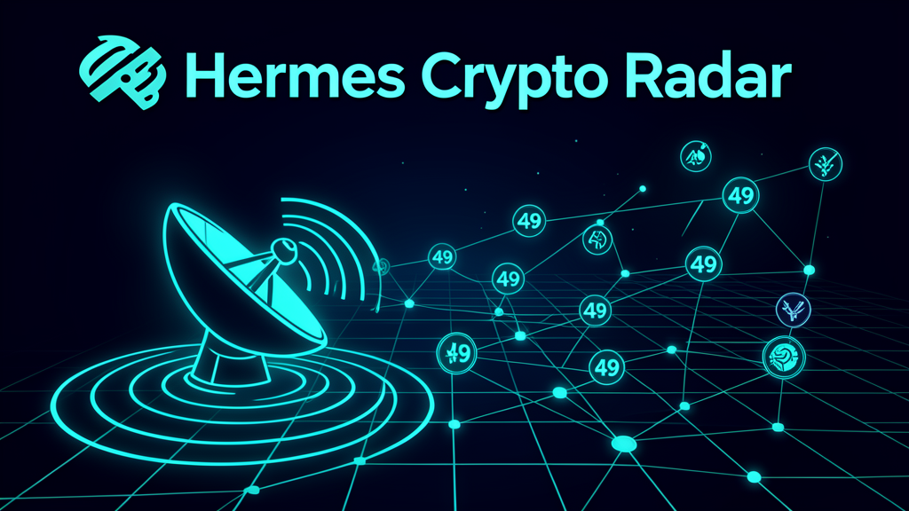
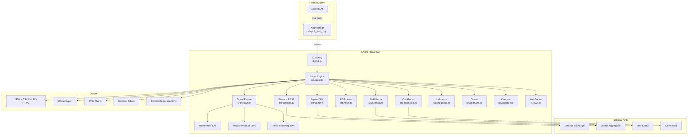
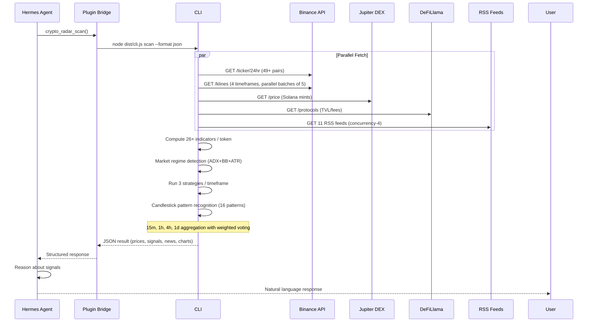
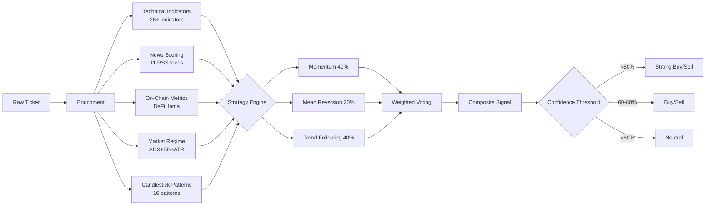

<p align="center">
  
</p>

<p align="center">
  <a href="https://github.com/ssdeanx/Hermes-Crypto-Radar/actions/workflows/ci.yml"></a>
  <a href="https://github.com/ssdeanx/Hermes-Crypto-Radar/actions/workflows/nightly-e2e.yml"></a>
  <a href="https://www.npmjs.com/package/hermes-crypto-radar"></a>
  <a href="https://www.npmjs.com/package/hermes-crypto-radar"></a>
  <br>
  <a href="https://github.com/ssdeanx/Hermes-Crypto-Radar"></a>
  <a href="LICENSE"></a>
  
  
  
</p>

<h1 align="center">🛰️ Hermes Crypto Radar</h1>
<p align="center"><strong>Enterprise-grade multi-chain crypto market intelligence — Hermes Agent plugin</strong></p>
<p align="center"><strong>49+ tokens across 31 chains with 26+ technical indicators</strong> — 3-strategy signal engine, DeFiLlama on-chain metrics, RSS news aggregation, SVG charts, and a warm daemon for sub-50ms tool calls. Built for <a href="https://hermes-agent.nousresearch.com/">Hermes Agent</a>.</p>

<p align="center">
  <a href="#-features">Features</a> •
  <a href="#-quick-start">Quick Start</a> •
  <a href="#-marketplace">Marketplace</a> •
  <a href="#-why-crypto-radar">Why Crypto Radar?</a> •
  <a href="#-use-cases">Use Cases</a> •
  <a href="#-architecture--data-flow">Architecture</a> •
  <a href="#-cli-reference">CLI Reference</a> •
  <a href="#-developer-api">Developer API</a> •
  <a href="#-enterprise-features">Enterprise</a> •
  <a href="#-roadmap">Roadmap</a> •
  <a href="SPEC.md">SPEC</a> •
  <a href="CHANGELOG.md">Changelog</a>
</p>

---

## 🛒 Marketplace

Hermes Crypto Radar is available on the **Hermes Marketplace** — the official plugin registry for Hermes Agent.

```bash
# Install from the Hermes Marketplace (recommended)
hermes plugins install crypto-radar

# Publish updates to the marketplace
hermes plugins publish crypto-radar

# List all installed marketplace plugins
hermes plugins list
```

> 💡 **Marketplace publishing** — Plugin authors can publish their Hermes plugins to the marketplace using `hermes plugins publish <name>`. The plugin must have a valid `plugin.yaml` with `type: plugin` and be registered via the Hermes Plugin API. See the [plugin development docs](https://hermes-agent.nousresearch.com/docs/plugins) for details.

---

## ✨ Features

| Area | Highlights |
|------|-----------|
| **🪙 Token Coverage** | **49+ tokens** across **31 chains** — Solana, Polygon, Ethereum, BNB, Bitcoin, XRP, Cardano, Dogecoin, Cosmos, Sui, Aptos, Sei, Celestia, Injective, Thorchain, NEAR, TRON, Stellar, Avalanche, Litecoin, Bitcoin Cash, Hedera, Bittensor, Polkadot, Filecoin, Zcash, Monero, Algorand, Tezos, Theta + dynamic top-50 volume detection |
| **📊 Technical Indicators** | **26+ indicators**: RSI (14), MACD (12/26/9), Bollinger Bands (20/2), ATR (14), MFI (14), OBV, Stochastic (%K/%D), Ichimoku Cloud, Williams %R, CMF, TSI, SMA, EMA, ADX, Parabolic SAR, CCI, Keltner Channels, ROC, VWAP, Force Index, ADL, Chaikin Oscillator, StochRSI, TRIX, KST, Elder-Ray, Fisher Transform, Mass Index |
| **🧠 Signal Engine** | 3 strategies: Momentum (40%), Mean Reversion (20%), Trend Following (40%) — weighted voting with confidence scoring, candlestick pattern recognition (16 patterns), market regime detection (ADX+BB+ATR) |
| **⏱️ Multi-Timeframe** | Parallel kline fetch across 15m, 1h, 4h, 1d intervals with weighted aggregation (15m=0.10, 1h=0.25, 4h=0.30, 1d=0.35) |
| **⛓️ On-Chain Metrics** | DeFiLlama integration — protocol TVL, chain TVL, fees (1d/7d/30d) — boosts signal confidence 0–15% |
| **📰 News Aggregation** | 11 RSS feeds with relevance scoring, dedup, poison-filtering via token headline/body matching, sentiment keyword analysis |
| **🎯 Dynamic Scan** | `--dynamic` flag auto-detects top N tokens by 24h volume (configurable, default: 50) |
| **📈 Charts** | SVG candlestick, line, multi-panel dashboard with CSS gradients, tooltips, crosshairs, responsive viewBox, accessibility; ASCII sparklines |
| **💾 Export** | JSON, CSV, Markdown, terminal table, **XLSX** (Excel/Sheets with frozen headers + conditional formatting), **HTML/PDF** self-contained reports |
| **🥇 Daemon Mode** | Warm HTTP daemon for sub-50ms tool calls, configurable cache refresh, health checks |
| **🛡️ Enterprise** | Circuit breaker (CLOSED/OPEN/HALF-OPEN), token-bucket rate limiter, TTL cache, atomic writes, log rotation (10MB → gzip, 30-day retention), typed error classes, SHA-256 file checksums |
| **⚙️ Configurable** | `radar.config.json` + `RADAR__*` env vars — strategy weights, timeframe weights, token whitelist, log level, data dir, cache TTL |
| **🔌 Hermes Plugin** | 8 agent tools returning structured JSON for agent reasoning — scan, signals, news, tokens, chart, daemon, onchain, ws |
| **📡 Real-Time** | WebSocket stream management for live price updates, Discord/Telegram webhook price alerts |
| **📁 Data Directory** | Standardized to `~/.hermes/data/crypto-radar/` — logs, rotation, cross-session persistence |
| **🔬 Advanced Analytics** | Correlation engine (N×N Pearson matrix), backtesting engine with weight optimization, Volume Profile (POC/HVN/LVN), support/resistance detection |

> **Requirements:** Node.js >= 22, Hermes Agent (for plugin integration). No API keys required — uses public Binance REST API + RSS feeds + DeFiLlama (free).

---

## 🚀 Quick Start

```bash
# Install via Hermes Marketplace (recommended)
hermes plugins install crypto-radar

# Or install globally via npm
npm install -g hermes-crypto-radar

# Run your first scan
crypto-radar scan --filter SOL --no-news --format table
```

### Your first 60 seconds

```bash
# 1. Scan the Solana ecosystem
crypto-radar scan --chain solana --format table

# 2. Check composite signals
crypto-radar signals --filter BTC ETH SOL

# 3. Generate a candlestick chart
crypto-radar chart SOL --type candlestick --period 1h --width 800

# 4. Check system health
crypto-radar health
```

<p align="center">
  
  <br>
  <sub><em>Architecture overview — multi-source data pipeline from Binance, DeFiLlama, RSS feeds to the Hermes Agent plugin bridge.</em></sub>
</p>

### Dynamic scan

```bash
# Auto-detect top 50 tokens by 24h volume
crypto-radar scan --dynamic --format table

# Top 20 with on-chain metrics
crypto-radar scan --dynamic 20 --onchain --format json
```

<details>
<summary><strong>📦 All installation methods</strong></summary>

### From Hermes Marketplace (recommended)
```bash
hermes plugins install crypto-radar
```

### From npm
```bash
npm install -g hermes-crypto-radar
crypto-radar scan --filter SOL BTC --no-news
```

### One-liner (no npm/node preinstalled)
```bash
curl -fsSL https://raw.githubusercontent.com/ssdeanx/Hermes-Crypto-Radar/main/scripts/install.sh | bash
```

### From source
```bash
git clone https://github.com/ssdeanx/Hermes-Crypto-Radar.git
cd Hermes-Crypto-Radar
npm install && npm run build
ln -sf "$PWD" ~/.hermes/plugins/crypto-radar
```
</details>

---

## 🎯 Why Crypto Radar?

| Feature | Crypto Radar | CoinGecko CLI | Binance CLI | CoinMarketCap API |
|---------|:------------:|:-------------:|:-----------:|:-----------------:|
| **Multi-chain coverage** | ✅ 31 chains | ✅ 100+ chains | ❌ Binance only | ✅ 400+ |
| **Technical indicators** | ✅ **26+** built-in | ❌ None | ❌ None | ❌ None |
| **Composite signal engine** | ✅ 3 strategies | ❌ | ❌ | ❌ |
| **On-chain metrics** | ✅ DeFiLlama | ✅ Limited | ❌ | ✅ Limited |
| **News aggregation** | ✅ 11 RSS feeds | ❌ | ❌ | ✅ |
| **SVG charts** | ✅ Candlestick, line, dashboard | ❌ | ❌ | ❌ |
| **XLSX/HTML/PDF export** | ✅ All formats | ❌ | ❌ | ✅ |
| **Hermes Agent plugin** | ✅ Native | ❌ | ❌ | ❌ |
| **Daemon mode (<50ms)** | ✅ Warm cache | ❌ | ❌ | ❌ |
| **Free (no API key)** | ✅ | ✅ Limited | ✅ | ❌ API key required |
| **Enterprise infra** | ✅ Circuit breaker, rate limiter, log rotation | ❌ | ❌ | ❌ |
| **Market regime detection** | ✅ ADX+BB+ATR | ❌ | ❌ | ❌ |

---

## 💡 Use Cases

### 📈 Trading Signals
Generate multi-timeframe composite signals with weighted strategy voting. Get buy/sell/neutral recommendations with confidence scores, on-chain TVL boosts, and news sentiment overlays.

```bash
crypto-radar signals --format table
crypto-radar scan --onchain --format json | jq '.signals[] | select(.compositeScore > 70)'
```

### 👁️ Market Monitoring
Run the warm daemon for continuous monitoring with sub-50ms tool calls. Set up Discord/Telegram webhooks for price alerts.

```bash
crypto-radar daemon --port 9877 --refresh 300
crypto-radar scan --dynamic 30 --no-news --no-log --quiet
```

### 📊 Portfolio Tracking
Track your portfolio tokens with enriched data, multi-timeframe trend analysis, and export-ready reports (CSV, XLSX, HTML).

```bash
crypto-radar scan --filter SOL BTC ETH ADA --format xlsx --onchain
crypto-radar scan --filter SOL --format html > report.html
```

### 🔬 Advanced Analysis
Leverage the correlation engine, backtesting framework, Volume Profile, and candlestick pattern recognition for deep market analysis.

```bash
crypto-radar backtest SOL --strategy momentum
crypto-radar chart SOL --type candlestick --period 1h
```

---

## 🏗 Architecture & Data Flow

### System Context Diagram



### Scan Pipeline — Data Flow



### Signal Pipeline



### Project Structure

```
hermes-crypto-radar/
├── src/
│   ├── cli.ts              # CLI entry (Commander.js)
│   ├── index.ts            # Public API exports
│   ├── types.ts            # Type definitions (31 chains, 4 timeframes)
│   ├── tokens.ts           # Token registry (49+ tokens, 31 chains)
│   ├── binance.ts          # Binance REST client (ticker + klines)
│   ├── coingecko.ts        # CoinGecko fallback price source
│   ├── indicators.ts       # 26+ technical indicators (RSI, MACD, BB, ATR, MFI, OBV,
│   │                       #   Stochastic, Ichimoku, Williams %R, CMF, TSI, ADX,
│   │                       #   Parabolic SAR, CCI, Keltner Channels, ROC, VWAP,
│   │                       #   Force Index, ADL, Chaikin Oscillator, StochRSI,
│   │                       #   TRIX, KST, Elder-Ray, Fisher Transform, Mass Index)
│   ├── onchain.ts          # DeFiLlama integration (TVL, fees, prices)
│   ├── news.ts             # RSS news fetcher + relevance matcher
│   ├── signals.ts          # Composite signal scoring + on-chain boost
│   ├── output.ts           # Formatters (table, JSON, CSV, MD)
│   ├── xlsx-export.ts      # Excel export via exceljs
│   ├── html-report.ts      # HTML/PDF self-contained report generator
│   ├── radar.ts            # Main enrichment pipeline
│   ├── daemon.ts           # Warm daemon for sub-50ms tool calls
│   ├── ws.ts               # WebSocket real-time price streams
│   ├── webhook.ts          # Discord/Telegram alert delivery
│   ├── core/               # Enterprise infrastructure
│   │   ├── config.ts       # Typed config (file + env + defaults)
│   │   ├── errors.ts       # 6 typed error classes
│   │   ├── cache.ts        # TTL-based in-memory cache
│   │   ├── rate-limiter.ts # Token-bucket rate limiter
│   │   ├── logger.ts       # Structured JSON logger (6 levels)
│   │   ├── circuit-breaker.ts # CLOSED/OPEN/HALF-OPEN states
│   │   └── log-rotation.ts # Rotate at 10MB, gzip, keep 5
│   ├── analysis/           # Strategy signal engine
│   │   ├── strategies.ts   # Strategy interface + types
│   │   ├── engine.ts       # Weighted voting engine + config overrides
│   │   ├── momentum.ts     # Momentum strategy (40%)
│   │   ├── mean-reversion.ts # Mean reversion (20%)
│   │   └── trend-following.ts # Trend following (40%)
│   ├── io/                 # Visual output
│   │   ├── charts.ts       # ASCII sparklines + SVG charts (line, candlestick, dashboard)
│   │   └── patterns.ts     # Candlestick pattern recognition (16 patterns)
│   └── monitor/            # System health
│       ├── health.ts       # Health checks (API, data, system)
│       ├── correlation.ts  # N×N Pearson correlation matrix
│       └── regression.ts   # Market regime classification
├── plugin/
│   ├── __init__.py         # Hermes plugin Python bridge
│   └── plugin.yaml         # Plugin metadata
├── data/                   # Log output directory
├── .github/workflows/      # CI pipeline (Node 20 & 22)
├── SPEC.md                 # Full specification
├── CHANGELOG.md            # Release history
├── CRYPTO-ENTERPRISE-AUDIT.md  # Enterprise audit
├── .env.example            # Environment config template
└── package.json
```

---

## 📋 CLI Reference

| Command | Alias | Description | Key Flags |
|---------|-------|-------------|-----------|
| `scan` | `s` | **Full market scan** — prices, indicators, news, signals, on-chain | `--filter`, `--dynamic`, `--chain`, `--format`, `--sort`, `--onchain`, `--period`, `--no-tech`, `--no-news`, `--no-log`, `--quiet`, `--alt-source` |
| `signals` | — | **Composite signals snapshot** — lightweight score summary | `--filter`, `--format` |
| `news` | — | **Crypto news** — fetch and match against tracked tokens | `--filter`, `--format` |
| `tokens` | — | **List tracked tokens** — by chain filter | `--chain` |
| `chart` | `c` | **Generate charts** — sparkline, moving average, SVG, candlestick, dashboard, watermark | `--type`, `--period`, `--lookback`, `--width` |
| `strategies` | `strat` | **List strategy modules** — names, weights, descriptions | — |
| `health` | — | **System health checks** — Binance API, data dir, uptime | — |
| `configure` | `config` | **Configuration** — show current or generate defaults | `--show`, `--generate` |
| `daemon` | — | **Warm daemon** — start/stop/status for sub-50ms tool calls | `--port`, `--refresh`, `--status`, `--stop` |
| `backtest` | — | **Strategy backtesting** — accuracy metrics, weight optimization | `--strategy`, `--period`, `--symbol` |
| `search` | — | **Token search** — find tokens by symbol/name/chain | `--query` |
| `report` | `r` | **Generate HTML/PDF report** | `--filter`, `--output` |

### Common Flags

| Flag | Type | Applies To | Description |
|------|------|-----------|-------------|
| `--filter <symbols...>` | `string[]` | scan, signals, news | Token symbols to include (e.g. `--filter SOL BTC`) |
| `--dynamic [count]` | `number` | scan | Auto-detect top N tokens by 24h volume (default: 50) |
| `--chain <chain>` | `string` | scan, tokens | Chain filter: `solana`, `polygon`, `bnb`, `ethereum`, etc. |
| `--format <fmt>` | `string` | scan | Output: `table` (default), `json`, `csv`, `md`, `xlsx`, `html` |
| `--sort <mode>` | `string` | scan | Sort: `momentum` (default), `alpha`, `change`, `volume`, `signal` |
| `--onchain` | `boolean` | scan | Include DeFiLlama on-chain metrics (TVL, fees) |
| `--period <interval>` | `string` | scan | Kline interval: `15m`, `1h`, `4h`, `1d` (default: all) |
| `--no-tech` | `boolean` | scan | Skip technical indicator computation |
| `--no-news` | `boolean` | scan | Skip news fetching |
| `--no-log` | `boolean` | scan | Skip CSV file logging |
| `--quiet` | `boolean` | scan | Suppress table output (for scripting/cron) |
| `--alt-source` | `boolean` | scan | Use CoinGecko as alternate price source |

---

## 🔌 Hermes Plugin Tools

When registered as a Hermes plugin, Crypto Radar exposes **8 agent tools**:

| Tool | Description | Returns |
|------|-------------|---------|
| **🛰️ `crypto_radar_scan`** | Full market scan — prices, indicators, news, signals, on-chain | JSON with `tickers[]`, `technicals{}`, `news[]`, `signals[]`, `onchain{}`, `run{}` |
| **🚀 `crypto_radar_signals`** | Ranked composite trading signals | JSON with ranked `signals[]` — symbol, chain, price, scores, alerts |
| **📰 `crypto_radar_news`** | Crypto news matching tracked tokens | JSON with `news[]` — headline, description, source, relevance |
| **📋 `crypto_radar_tokens`** | List all tracked tokens | JSON with `tokens[]` — symbol, name, chain |
| **📊 `crypto_radar_chart`** | SVG chart as agent visual response | SVG markup with responsive viewBox, gradients, tooltips |
| **⚙️ `crypto_radar_daemon`** | Warm daemon lifecycle management (start/stop/status) | JSON status with cache state, uptime |
| **⛓️ `crypto_radar_onchain`** | On-chain metrics (protocol TVL, chain TVL, DEX fees) | JSON with protocols, chains, fees |
| **🔌 `crypto_radar_ws`** | WebSocket stream management for real-time prices | JSON with connection status, subscribed symbols |

All tools return structured JSON optimized for agent reasoning. Register via `plugin.yaml` → symlink into `~/.hermes/plugins/`.

---

## 💻 Developer API

Use Crypto Radar programmatically in your own Node.js projects:

```typescript
import { scan, getSignals, getNews, getTokens, getChart } from 'hermes-crypto-radar';

// Full market scan
const result = await scan({
  filter: ['SOL', 'BTC', 'ETH'],
  noNews: false,
  onchain: true,
  format: 'json'
});
console.log(result.tickers);
console.log(result.signals);

// Composite signals only
const signals = await getSignals({ filter: ['SOL'] });
console.log(signals);

// Fetch news
const news = await getNews({ filter: ['BTC'] });
console.log(news);

// Generate SVG chart
const svg = await getChart({
  symbol: 'SOL',
  type: 'candlestick',
  period: '1h',
  width: 800
});

// List tracked tokens
const tokens = await getTokens({ chain: 'solana' });
```

```typescript
// TypeScript types included
import type { EnrichedTicker, TokenSignal, RadarOptions } from 'hermes-crypto-radar';
```

### Programmatic configuration

```typescript
import { configure } from 'hermes-crypto-radar/core/config.js';

configure({
  strategyWeights: { momentum: 0.5, meanReversion: 0.2, trendFollowing: 0.3 },
  cacheTtl: 60_000,
  logLevel: 'info'
});
```

---

## 📦 Output Formats

| Format | Command | Description |
|--------|---------|-------------|
| `json` | `--format json` | Structured data for programmatic use |
| `csv` | `--format csv` | Spreadsheet-compatible rows |
| `md` | `--format md` | Markdown report |
| `table` | `--format table` | Terminal table (default) |
| `xlsx` | `--format xlsx` | Excel workbook with frozen headers, auto-width, conditional coloring |
| `html` | `--format html` | Self-contained dark-theme HTML report with interactive tables |

---

## 📊 Benchmarks

| Metric | Value |
|--------|-------|
| **Scan time** (49 tokens, full indicators + news) | ~8–12s |
| **Scan time** (49 tokens, cached indicators) | ~3–5s |
| **Daemon response time** (warm cache) | <50ms |
| **Parallel kline fetching** (4 timeframes, 49 tokens) | ~60% reduction vs sequential |
| **News aggregation** (11 feeds, concurrency-4) | ~2s vs ~12s sequential |
| **Test coverage** | 332+ tests |
| **Indicator fuzz tests** | 130 edge-case tests (NaN, Infinity, empty) |
| **Supported token pairs** | 49+ (Binance USDT) |
| **Build time** | ~3s (TypeScript → dist) |

---

## 🏢 Enterprise Features

Crypto Radar ships with production-grade enterprise infrastructure:

| Feature | Description |
|---------|-------------|
| **🔁 Circuit Breaker** | CLOSED/OPEN/HALF-OPEN with configurable failure threshold and cached-fallback |
| **⏱️ Rate Limiter** | Token-bucket algorithm — configurable max requests per time window |
| **🗃️ TTL Cache** | In-memory cache with auto-expiry, stats tracking, memoize support |
| **📝 Log Rotation** | 10MB rotate → gzip compress → keep 5 archives → 30-day data retention policy |
| **🔐 Atomic Writes** | `.tmp` → `fs.renameSync()` — zero partial-write data loss |
| **✅ Typed Errors** | 6 error classes: `CryptoRadarError`, `NetworkError`, `RateLimitError`, `DataError`, `ConfigError`, `DaemonError` |
| **📐 Config System** | JSON config file + `RADAR__*` env vars with typed defaults and schema validation |
| **🔍 Health Checks** | Binance API status, data directory integrity, system resources, uptime tracking |
| **🔏 SHA-256 Checksums** | File integrity verification for log archives and exports |
| **🔄 Data Retention** | Configurable pruning by age with checksum verification |

---

## 🗺 Roadmap — v2.0.0

| Feature | Status | Target |
|---------|--------|--------|
| **Hermes Marketplace release** | ✅ **v2.0.0** | Released |
| **Portfolio tracking** (user-defined holdings → P&L) | 🔜 | v2.0.1 |
| **Multi-user watchlists** (shared token lists via config) | 🔜 | v2.0.1 |
| **WebSocket live prices** (real-time Binance WS streams) | 🔜 | v2.0.2 |
| **AI-driven signal suggestions** (LLM-powered trade ideas) | 🔜 | v2.0.2 |
| **Custom indicator scripting** (user-defined indicators in TS) | 🔜 | v2.0.3 |
| **Backtesting dashboard** (web UI for strategy optimization) | 🔜 | v2.1.0 |
| **Real-time alert engine** (price thresholds, indicator crossovers) | 🔜 | v2.1.0 |
| **DEX aggregation** (Uniswap, Raydium, Orca, Jupiter) | 🔜 | v2.1.0 |
| **Social sentiment analysis** (X/Twitter, Reddit, Discord) | 🔜 | v2.2.0 |
| **Paper trading simulator** | 🔜 | v2.2.0 |
| **Mobile companion** (Hermes mobile plugin) | 🔜 | v3.0.0 |

---

## 👥 Contributors

<a href="https://github.com/ssdeanx"></a>

- **Sam** — Creator & maintainer ([@ssdeanx](https://github.com/ssdeanx))
- Contributions welcome! See [CONTRIBUTING.md](CONTRIBUTING.md) (coming soon) or open a [PR](https://github.com/ssdeanx/Hermes-Crypto-Radar/pulls).

---

## 🛠 Development

```bash
npm run build        # TypeScript compile → dist/
npm run watch        # Watch mode for development
npm run start        # Run CLI (default: scan)
npm test             # Run vitest suite (332+ tests)
npm run test:watch   # Watch mode for TDD
npm run test:coverage # Test coverage report
npm run lint         # ESLint check
npm run lint:fix     # ESLint auto-fix
npm run format       # Prettier check
npm run format:fix   # Prettier auto-format
npm run clean        # rm -rf dist/
npm run daemon       # Start warm daemon
npm run daemon:status # Check daemon status
npm run benchmark    # Run performance benchmarks
npm run backtest     # Run strategy backtesting
npm run docs         # Generate TypeDoc API reference
```

### Project Scripts

```bash
# Comprehensive scan by chain
node dist/cli.js scan --chain solana --format json

# Export to Excel
node dist/cli.js scan --filter SOL BTC ETH --format xlsx --no-news

# Signals view (lightweight)
node dist/cli.js signals --filter SOL

# Token chart (candlestick with EMA overlays)
node dist/cli.js chart SOL --type candlestick --period 1h --width 800

# System health
node dist/cli.js health

# Dynamic top-50 scan with on-chain metrics
node dist/cli.js scan --dynamic --onchain --format table

# Generate HTML report
node dist/cli.js report --filter SOL BTC --output report.html

# Start the warm daemon
node dist/cli.js daemon --port 9877 --refresh 300

# Strategy backtesting
node dist/cli.js backtest SOL --strategy momentum --period 30d
```

---

## 📚 Documentation

- **[SPEC.md](SPEC.md)** — Full project specification with architecture, token roster, tool reference, data flow, scoring models, development guide, and publishing plan
- **[CHANGELOG.md](CHANGELOG.md)** — Full release history from v1.0.0 to v2.0.0
- **[CRYPTO-ENTERPRISE-AUDIT.md](CRYPTO-ENTERPRISE-AUDIT.md)** — Enterprise-grade audit covering security, reliability, performance, and code quality
- **[docs/api/](docs/api/)** — Auto-generated TypeDoc API reference

---

## 📄 License

MIT © Sam

---

## 🔒 Security

See [SECURITY.md](SECURITY.md) for our security policy, vulnerability disclosure process, and architecture overview.

### Security Headers

The warm daemon HTTP endpoints include the following security headers to protect against common web vulnerabilities:

| Header | Value |
|--------|-------|
| `X-Content-Type-Options` | `nosniff` |
| `X-Frame-Options` | `DENY` |
| `Strict-Transport-Security` | `max-age=31536000` |
| `Content-Security-Policy` | `default-src 'none'; frame-ancestors 'none'` |
| `Referrer-Policy` | `no-referrer` |
| `Cache-Control` | `no-store` |

### Zero API Key Design

Hermes Crypto Radar uses **only public APIs** — no API keys, tokens, or credentials are required. All data sources (Binance public API, CoinGecko free tier, DeFiLlama, RSS feeds) are freely accessible.

### Supply Chain Security
- `npm audit` runs as part of CI to detect dependency vulnerabilities
- npm overrides for transitive vulnerability fixes (see `package.json`)
- Regular dependency updates tracked in [CHANGELOG.md](CHANGELOG.md)

---

<p align="center">
  <strong>🛰️ Hermes Crypto Radar</strong> — Production-grade crypto market intelligence for <a href="https://hermes-agent.nousresearch.com/">Hermes Agent</a>.
  <br><br>
  <a href="https://github.com/ssdeanx/Hermes-Crypto-Radar"></a>
  &nbsp;
  <a href="https://www.npmjs.com/package/hermes-crypto-radar"></a>
  &nbsp;
  <a href="https://github.com/ssdeanx/Hermes-Crypto-Radar/issues"></a>
  &nbsp;
  <a href="https://github.com/ssdeanx/Hermes-Crypto-Radar/pulls"></a>
  <br><br>
  <sub>Made with ❤️ by <a href="https://github.com/ssdeanx">Sam</a> — Built for traders, by traders. MIT licensed.</sub>
  <br>
  <sub>⭐ Star us on GitHub — every star helps us prioritize features and fix issues faster.</sub>
</p>
