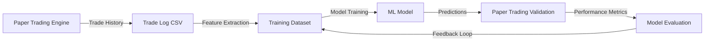
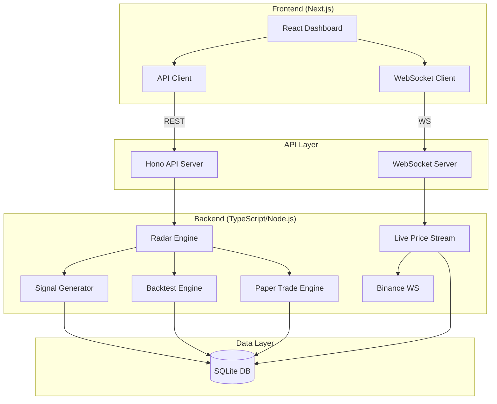
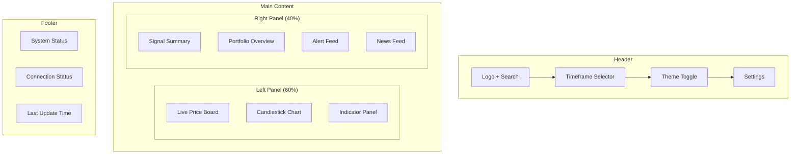
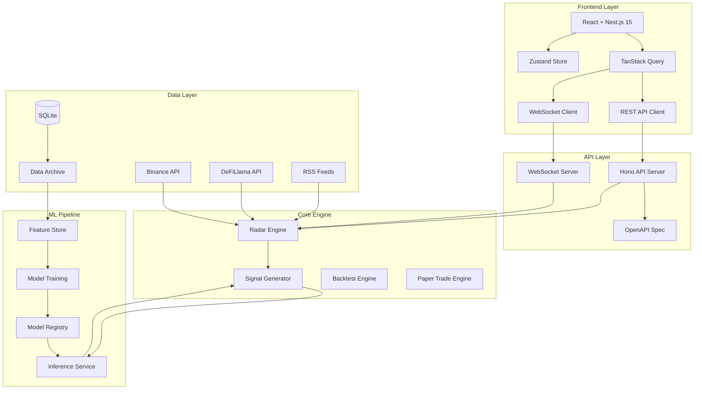
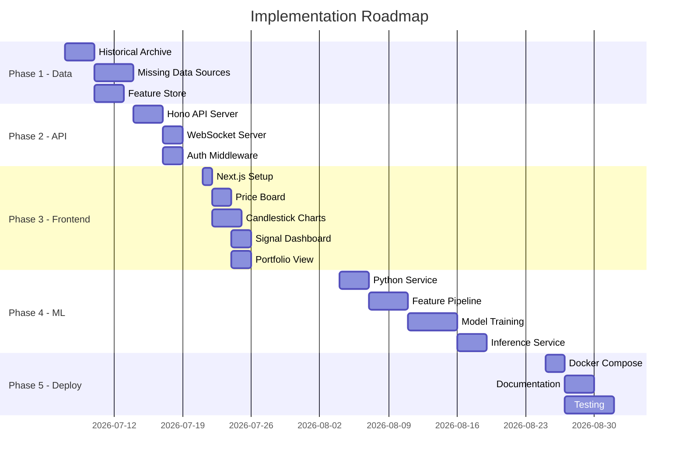

# Research Report: Frontend Architecture & AI/ML Datasets for Hermes Crypto Radar

> **Date**: 2026-07-06  
> **Author**: Hermes Research Agent  
> **Scope**: Frontend architecture, AI agent training datasets, similar project comparison, gaps & recommendations

---

## Table of Contents

1. [AI Agent Training Datasets for Crypto Trading Signals](#1-ai-agent-training-datasets-for-crypto-trading-signals)
2. [Frontend Architecture for Crypto Dashboard](#2-frontend-architecture-for-crypto-dashboard)
3. [Similar Projects Comparison](#3-similar-projects-comparison)
4. [Gaps and Recommendations](#4-gaps-and-recommendations)
5. [Implementation Roadmap](#5-implementation-roadmap)

---

## 1. AI Agent Training Datasets for Crypto Trading Signals

### 1.1 Best Practices for Dataset Construction

Building effective AI/ML training datasets for crypto trading signals requires a structured approach that captures the multi-dimensional nature of market data.

#### Data Collection Principles

- **Temporal Consistency**: All data sources must share synchronized timestamps. Use UTC consistently across all data streams.
- **Survivorship Bias Avoidance**: Include delisted tokens, failed protocols, and chains that no longer exist.
- **Regime Labeling**: Label data by market regime (trending, ranging, volatile, calm) using the existing ADX+BB+ATR detection in `src/analysis/regime.ts`.
- **Forward-Looking Labels**: Define clear prediction horizons (1h, 4h, 24h, 7d) and label outcomes accordingly.
- **Class Balance**: Crypto datasets are inherently imbalanced (~55% of periods are neutral). Use SMOTE, class weighting, or focal loss.

#### Recommended Feature Categories

| Category | Features | Hermes Already Has? |
|----------|----------|-------------------|
| **Price Action** | OHLCV, VWAP, range position, spread | Yes (Binance ticker) |
| **Technical Indicators** | RSI, MACD, BB, ATR, MFI, Stochastic, Ichimoku, Williams %R, CMF, TSI, ADX, PSAR, CCI, Keltner, ROC, Force Index, ADL, Chaikin, StochRSI, TRIX, KST, Elder-Ray, Fisher, Mass Index | Yes (26 indicators) |
| **Volume Analysis** | OBV, volume profile, taker buy ratio, volume trend | Partial (OBV, volVsAvg) |
| **Order Book** | Bid/ask depth, imbalance, spread | Partial (bookImbalance, spreadPct) |
| **On-Chain** | TVL, fees, active addresses, whale movements, exchange flows | Partial (DeFiLlama TVL, fees) |
| **Sentiment** | News volume, social media mentions, Fear & Greed Index | Partial (RSS news) |
| **Derivatives** | Funding rates, open interest, long/short ratio, liquidations | **Missing** |
| **Cross-Asset** | BTC dominance, DXY correlation, total market cap | **Missing** |
| **Temporal** | Hour of day, day of week, month, seasonality features | **Missing** |

### 1.2 Data Sources for Comprehensive ML Training

#### Tier 1: Essential (Must Have)

| Source | Data Type | Access | Hermes Integration |
|--------|-----------|--------|-------------------|
| **Binance API** | OHLCV, order book, trades, funding rates | REST/WS | Already integrated |
| **DeFiLlama** | TVL, fees, revenue by protocol | REST | Already integrated |
| **CoinGecko** | Market cap, volume, price history | REST | Already integrated |
| **RSS Feeds** | News articles, sentiment | RSS | Already integrated |

#### Tier 2: High Value (Should Add)

| Source | Data Type | Access | Priority |
|--------|-----------|--------|----------|
| **Coinalyze / Glassnode** | On-chain metrics, exchange flows | REST/WebSocket | High |
| **Fear & Greed Index** | Market sentiment (0-100) | REST API | High |
| **Binance Futures** | Funding rates, open interest, long/short ratio | REST/WS | High |
| **CryptoQuant** | Exchange reserves, miner data, whale alerts | REST | Medium |
| **Santiment** | Social volume, dev activity, token circulation | REST | Medium |
| **LunarCrush** | Social media metrics, galaxy scores | REST | Medium |

#### Tier 3: Advanced (Nice to Have)

| Source | Data Type | Access | Priority |
|--------|-----------|--------|----------|
| **Dune Analytics** | Custom on-chain queries | SQL API | Low |
| **The Graph** | Decentralized indexing | GraphQL | Low |
| **Chainsight** | Cross-chain analytics | REST | Low |
| **Messari** | Fundamentals, governance data | GraphQL | Low |

### 1.3 Dataset Structure for ML/RL Training

#### Recommended Schema (Parquet Format)

```python
# Schema for training dataset (one row per token per time interval)
{
    # Identifiers
    "timestamp": "datetime64[ns, UTC]",     # Exact timestamp
    "token_id": "string",                    # e.g., "solana"
    "symbol": "string",                      # e.g., "SOLUSDT"
    "chain": "string",                       # e.g., "solana"
    "interval": "string",                    # e.g., "1h", "4h", "1d"

    # Price Features (current)
    "open": "float64",
    "high": "float64",
    "low": "float64",
    "close": "float64",
    "volume": "float64",
    "quote_volume": "float64",
    "spread_pct": "float64",
    "vwap_dist_pct": "float64",
    "range_pos_pct": "float64",
    "book_imbalance": "float64",

    # Technical Indicators (26 features)
    "rsi": "float64",
    "macd": "float64",
    "macd_signal": "float64",
    "macd_histogram": "float64",
    "bb_upper": "float64",
    "bb_lower": "float64",
    "bb_width": "float64",
    "bb_position": "float64",
    "atr_pct": "float64",
    "mfi": "float64",
    "stoch_k": "float64",
    "stoch_d": "float64",
    "williams_r": "float64",
    "cmf": "float64",
    "tsi": "float64",
    "adx": "float64",
    "cci": "float64",
    "roc": "float64",
    "force_index": "float64",
    "stoch_rsi": "float64",
    "trix": "float64",
    "kst": "float64",
    "elder_bull": "float64",
    "elder_bear": "float64",
    "fisher": "float64",
    "mass_index": "float64",

    # Derived Features
    "momentum_score": "float64",
    "technical_score": "float64",
    "composite_score": "float64",
    "adx_strength": "float64",
    "volatility_factor": "float64",
    "regime": "string",                      # risk-on, risk-off, neutral

    # On-Chain Features
    "tvl": "float64",
    "tvl_trend": "string",                   # up, flat, down
    "fees_1d": "float64",

    # News Features
    "news_count": "int32",
    "news_relevance_avg": "float64",

    # Labels (what we're predicting)
    "label_return_1h": "float64",            # Actual return after 1 hour
    "label_return_4h": "float64",
    "label_return_24h": "float64",
    "label_direction_1h": "int8",            # 1=bullish, 0=neutral, -1=bearish
    "label_direction_4h": "int8",
    "label_direction_24h": "int8",
    "label_regime_next": "string",           # Next period's regime
}
```

#### RL Environment State Space

```python
# For reinforcement learning agents (e.g., Stable-Baselines3)
{
    "observation_space": {
        # Price window (last N candles flattened)
        "price_features": "float32[64, 12]",  # 64 timesteps, 12 price features
        # Indicator window
        "indicator_features": "float32[64, 26]",  # 64 timesteps, 26 indicators
        # Portfolio state
        "portfolio": "float32[4]",  # cash, position_size, unrealized_pnl, num_trades
    },
    "action_space": {
        # Discrete: 0=hold, 1=buy_25%, 2=buy_50%, 3=buy_100%,
        #           4=sell_25%, 5=sell_50%, 6=sell_100%
        "action": "discrete(7)"
    }
}
```

### 1.4 How Paper Trading Fits into Dataset Building

The existing paper trading engine (`src/paper-trade.ts`) is a critical bridge between backtesting and live ML training:

#### Paper Trading → Dataset Pipeline



#### What Paper Trading Provides

1. **Signal Validation Data**: Record which signals led to profitable vs losing trades
2. **Position Sizing Feedback**: Track whether ATR-based position sizing improves risk-adjusted returns
3. **Human Decision Patterns**: When humans override signals, record the reasoning (for supervised learning)
4. **Real-World Slippage**: Paper trading with live prices captures realistic execution conditions
5. **Regime Transitions**: Track how signals perform across different market regimes

#### Recommended Paper Trading Enhancements for ML

```typescript
// Add to PaperTrade interface
interface MLDataPoint {
  // Context at trade time
  signalSnapshot: TokenSignal;     // Full signal data at decision time
  marketContext: MarketRegime;     // Current regime
  indicators: TechnicalIndicators; // All 26 indicators

  // Outcome data
  actualReturn1h: number;
  actualReturn4h: number;
  actualReturn24h: number;
  maxDrawdown: number;
  sharpeContribution: number;

  // Decision metadata
  decisionSource: 'signal' | 'human' | 'hybrid';
  confidenceAtEntry: number;
  positionSizeUsed: number;
}
```

### 1.5 Gaps in Current Hermes Data Pipeline

| Gap | Severity | Impact on ML | Recommendation |
|-----|----------|-------------|----------------|
| No historical data storage | Critical | Cannot train on past signals | Add SQLite/Parquet archive |
| No funding rates | High | Missing derivatives sentiment | Add Binance futures API |
| No open interest | High | Missing positioning data | Add Binance OI endpoint |
| No Fear & Greed Index | Medium | Missing sentiment baseline | Add alternative.me API |
| No exchange flow data | Medium | Missing whale movement signals | Add CryptoQuant/Glassnode |
| No cross-asset correlation | Medium | Missing BTC dominance, DXY | Add CoinGecko global data |
| No multi-timeframe features | Medium | Limited temporal context | Add 15m + 1h + 4h + 1d features |
| No label engineering | High | Cannot define ML targets | Implement forward-return labeling |
| No data versioning | Medium | Cannot reproduce experiments | Add DVC or similar |
| No feature store | Medium | Feature computation redundancy | Add feature caching layer |

---

## 2. Frontend Architecture for Crypto Dashboard

### 2.1 Framework Comparison

#### Evaluation Matrix

| Criteria | React + Next.js | Svelte + SvelteKit | Vue 3 + Nuxt | SolidJS |
|----------|----------------|--------------------|--------------|---------|
| **Learning Curve** | Medium | Low-Medium | Low | Medium |
| **Real-Time Performance** | Good | Excellent | Good | Excellent |
| **Bundle Size** | ~40KB | ~10KB | ~15KB | ~8KB |
| **Ecosystem** | Excellent | Growing | Good | Small |
| **Charting Libraries** | All supported | Most supported | Most supported | Limited |
| **TypeScript Support** | Excellent | Good | Good | Excellent |
| **WebSocket Patterns** | Good | Excellent | Good | Excellent |
| **SSR/SSG** | Excellent | Good | Good | Good |
| **Community Size** | Largest | Growing | Large | Small |
| **Job Market** | Best | Growing | Good | Small |

#### Recommendation: **React 19 + Next.js 15**

**Justification**:
1. **Ecosystem**: React has the largest library ecosystem for financial dashboards
2. **TradingView Integration**: `lightweight-charts` has official React wrappers
3. **TypeScript**: Full type safety with Next.js 15 App Router
4. **Real-Time**: Excellent WebSocket support with React Query
5. **Deployment**: Vercel/Cloudflare Pages for free hosting
6. **Hiring**: Largest talent pool for future contributors

### 2.2 Charting Library Comparison

| Library | Candlesticks | Technical Overlays | Bundle Size | Performance | License |
|---------|-------------|-------------------|-------------|-------------|---------|
| **TradingView Lightweight Charts** | Excellent | Good (custom) | ~45KB | Excellent | Apache 2.0 |
| **Recharts** | Basic | Limited | ~35KB | Good | MIT |
| **D3.js** | Custom | Full control | ~250KB | Good | ISC |
| **ApexCharts** | Excellent | Good | ~120KB | Good | MIT |
| **ECharts** | Excellent | Excellent | ~800KB | Excellent | Apache 2.0 |
| **Visx (Airbnb)** | Custom | Full control | ~50KB | Good | MIT |

#### Recommendation: **TradingView Lightweight Charts v5.2** + **Recharts for dashboards**

**Justification**:
1. **Lightweight Charts v5.2**: Industry-standard candlestick charts, only 45KB, used by TradingView themselves
2. **Recharts**: Simple bar/line charts for portfolio, P&L, and signal distribution
3. **Custom Overlays**: Lightweight Charts supports custom series for indicators (RSI, MACD panels)
4. **Performance**: Sub-millisecond rendering for real-time WebSocket data
5. **Pane Support (v5.0+)**: Multiple synchronized chart panes for multi-timeframe analysis

### 2.3 Backend Connection Architecture

#### Current State
- CLI-based interface
- WebSocket live prices (`src/ws.ts`)
- Warm daemon mode (`src/daemon.ts`)
- No HTTP API server

#### Recommended Architecture



#### API Design

```typescript
// REST API endpoints (Hono server)
const routes = {
  // Signals
  'GET /api/signals': 'List current signals for all tokens',
  'GET /api/signals/:symbol': 'Get signal for specific token',
  'GET /api/signals/history': 'Historical signals with pagination',

  // Market Data
  'GET /api/tickers': 'Current enriched tickers',
  'GET /api/tickers/:symbol': 'Specific ticker with indicators',
  'GET /api/klines': 'OHLCV data with interval parameter',
  'GET /api/indicators': 'All technical indicators for a token',

  // Portfolio
  'GET /api/portfolio': 'Current paper trading portfolio',
  'POST /api/portfolio/trade': 'Execute paper trade',
  'GET /api/portfolio/history': 'Trade history',
  'GET /api/portfolio/performance': 'Performance metrics',

  // Backtesting
  'POST /api/backtest/run': 'Run backtest with parameters',
  'GET /api/backtest/results': 'List backtest results',
  'GET /api/backtest/:id': 'Specific backtest result',

  // News
  'GET /api/news': 'Recent news articles',
  'GET /api/news/:symbol': 'News for specific token',

  // System
  'GET /api/health': 'System health check',
  'GET /api/stats': 'System statistics',
};

// WebSocket events
const wsEvents = {
  'price:update': 'Real-time price updates',
  'signal:new': 'New signal generated',
  'alert:triggered': 'Alert fired',
  'portfolio:update': 'Portfolio state change',
  'news:new': 'New article matched',
};
```

#### Technology Choice: **Hono** (not Express/Fastify)

```typescript
// Why Hono over alternatives
// - 14KB (vs Express 200KB, Fastify 50KB)
// - Edge-compatible (Cloudflare Workers, Vercel Edge)
// - TypeScript-first with OpenAPI generation
// - Built-in WebSocket, CORS, rate limiting
// - 10x faster than Express in benchmarks
```

### 2.4 Frontend Feature Requirements

#### Dashboard Features

| Feature | Priority | Description |
|---------|----------|-------------|
| **Live Price Board** | P0 | Real-time prices with % change, volume, sparkline |
| **Signal Dashboard** | P0 | Composite scores, direction, confidence, alerts |
| **Candlestick Charts** | P0 | Interactive charts with indicators overlay |
| **Paper Trading UI** | P1 | Buy/sell interface, portfolio view, P&L tracking |
| **Portfolio Tracker** | P1 | Holdings, performance metrics, equity curve |
| **Alert Management** | P1 | Configure alerts, notification history |
| **Backtest UI** | P2 | Parameter configuration, results visualization |
| **News Feed** | P2 | Aggregated news with relevance scoring |
| **Multi-Timeframe View** | P2 | 15m/1h/4h/1d synchronized charts |
| **Settings** | P3 | Token whitelist, notification preferences |

#### State Management

```typescript
// Recommended: TanStack Query + Zustand
// TanStack Query: Server state (API data, WebSocket)
// Zustand: Client state (UI preferences, theme, filters)

// Store structure
interface AppState {
  // UI State (Zustand)
  theme: 'light' | 'dark';
  selectedToken: string | null;
  timeInterval: KlineInterval;
  dashboardLayout: LayoutConfig;

  // Server State (TanStack Query)
  signals: QueryState<TokenSignal[]>;
  portfolio: QueryState<PortfolioState>;
  news: QueryState<NewsArticle[]>;
}
```

### 2.5 Dashboard Layout



---

## 3. Similar Projects Comparison

### 3.1 Detailed Comparison Table

| Feature | Freqtrade | Jesse | NautilusTrader | Hummingbot | **Hermes** |
|---------|-----------|-------|----------------|------------|------------|
| **Language** | Python | Python + JS | Rust + Python | Python + Cython | **TypeScript** |
| **Stars** | 52.1k | 8.1k | 24.5k | 19.1k | **Growing** |
| **License** | GPL-3.0 | MIT | LGPL-3.0 | Apache-2.0 | **MIT** |
| **Web UI** | FreqUI (Vue) | Built-in (JS) | None | Dashboard | **None (planned)** |
| **Telegram Bot** | Yes | Yes | No | Condor | **No** |
| **Backtesting** | Yes | Yes | Yes | Limited | **Yes** |
| **ML/AI** | FreqAI (sklearn, PyTorch) | Built-in (sklearn) | RL capable | Limited | **No** |
| **Indicators** | 130+ (TA-Lib) | 300+ | Custom | Limited | **26** |
| **Exchange Support** | 15+ exchanges | Binance, Bybit | 10+ venues | 140+ connectors | **Binance** |
| **Paper Trading** | Yes | Yes | Yes | Yes | **Yes** |
| **WebSocket** | Yes | Yes | Yes | Yes | **Yes** |
| **Multi-Timeframe** | Yes | Yes | Yes | Limited | **Yes (4 intervals)** |
| **Docker** | Yes | Yes | Yes | Yes | **No** |
| **API Server** | REST API | REST API | Custom | REST API | **CLI only** |

### 3.2 Freqtrade Deep Dive

**Architecture**: Python monolith with SQLite persistence, plugin-based strategy system.

**ML Integration (FreqAI)**:
- Built-in ML pipeline with scikit-learn, PyTorch, XGBoost, LightGBM
- Adaptive prediction modeling (trains on recent data, deploys predictions)
- Feature engineering: 100+ indicators, custom feature spaces
- RL support via Stable-Baselines3
- Data format: pandas DataFrames with OHLCV + indicators
- Training data: CSV/SQLite stored in `user_data/`

**Key Patterns to Adopt**:
1. **Feature Space Configuration**: Users define which indicators feed into ML models
2. **Online Learning**: Models retrain periodically on recent data
3. **Backtest-First**: All strategies validated via backtesting before live deployment
4. **Configuration-Driven**: YAML-based strategy configuration

**Weaknesses**: 
- Python-only (no TypeScript ecosystem)
- Heavy dependencies (TA-Lib, pandas, numpy)
- Complex configuration for beginners

### 3.3 Jesse Deep Dive

**Architecture**: Python backend with JavaScript frontend, clean strategy API.

**ML Integration**:
- Built-in ML pipeline: gather → train → deploy
- Uses scikit-learn for binary/multiclass/regression
- Feature recording: `record_features()` in strategy
- Label recording: `record_label()` after outcome known
- Auto-saves to CSV, model loading handled automatically
- Monte Carlo analysis for overfitting detection

**Key Patterns to Adopt**:
1. **Three-Phase ML**: Gather data → Train model → Deploy in strategy
2. **Simple Strategy Syntax**: `should_long()`, `go_long()` pattern
3. **Built-in Code Editor**: Web-based strategy editing
4. **JesseGPT**: AI assistant for strategy writing

**Weaknesses**:
- Limited exchange support (Binance, Bybit)
- Smaller community than Freqtrade
- JavaScript frontend is basic

### 3.4 NautilusTrader Deep Dive

**Architecture**: Rust core with Python control plane, event-driven, deterministic.

**ML Integration**:
- Engine fast enough for RL/ES training
- Deterministic backtesting with nanosecond resolution
- Same execution semantics in research and live
- Custom data types for ML features

**Key Patterns to Adopt**:
1. **Event-Driven Architecture**: Same code for backtest and live
2. **Rust Core**: Performance-critical path in Rust
3. **Adapter Pattern**: Modular exchange connectors
4. **Message Bus**: Internal pub/sub for components

**Weaknesses**:
- Steep learning curve (Rust required for core work)
- No built-in web UI
- Complex deployment (requires Rust toolchain)

### 3.5 Hummingbot Deep Dive

**Architecture**: Python monolith, connector-based exchange integration.

**ML Integration**:
- Limited built-in ML
- Focus on market making strategies
- Gateway middleware for DEX integration
- MCP server for AI assistant integration

**Key Patterns to Adopt**:
1. **Connector Architecture**: 140+ exchange connectors
2. **Gateway Pattern**: TypeScript middleware for DEX
3. **Community Governance**: HBOT token voting for proposals
4. **MCP Integration**: AI assistants can control the bot

**Weaknesses**:
- Focused on market making, not signal-based trading
- Limited ML capabilities
- Complex connector system

### 3.6 Architecture Patterns Summary

| Pattern | Freqtrade | Jesse | NautilusTrader | Hummingbot | Hermes Should Adopt? |
|---------|-----------|-------|----------------|------------|---------------------|
| **Plugin System** | Strategy plugins | Strategy classes | Adapter pattern | Connector pattern | Yes (TypeScript plugins) |
| **Event-Driven** | No | No | Yes | Partial | Yes |
| **REST API** | Yes | Yes | Custom | Yes | Yes (Hono) |
| **WebSocket** | Yes | Limited | Yes | Yes | Yes (already has) |
| **SQLite Persistence** | Yes | Yes | Optional (Redis) | No | Yes (already has) |
| **ML Pipeline** | FreqAI | Built-in | RL capable | No | Build separate |
| **Web UI** | Vue.js | Custom JS | No | Dashboard | React + Next.js |
| **Docker** | Yes | Yes | Yes | Yes | Yes (add) |
| **Configuration** | YAML | Python config | YAML | YAML | TypeScript config |

---

## 4. Gaps and Recommendations

### 4.1 Gaps for AI Agent Dataset Building

#### Critical Gaps

1. **No Historical Data Archive**
   - Current: Data is fetched live, not stored
   - Impact: Cannot train on past signals
   - Solution: Add SQLite/Parquet archive with cron-based collection

2. **No Label Engineering**
   - Current: Backtesting compares predicted vs actual direction
   - Impact: No forward-return labels for supervised learning
   - Solution: Implement multi-horizon labeling (1h, 4h, 24h returns)

3. **No Feature Store**
   - Current: Indicators computed on-demand each scan
   - Impact: Redundant computation, no versioning
   - Solution: Add feature caching with hash-based versioning

#### High Priority Gaps

4. **Missing Derivatives Data**
   - Current: Only spot market data from Binance
   - Impact: Cannot capture market sentiment from futures
   - Solution: Add Binance Futures API for funding rates, OI, long/short ratio

5. **No Cross-Asset Features**
   - Current: Tokens analyzed in isolation
   - Impact: Missing BTC dominance, total market cap correlation
   - Solution: Add CoinGecko global metrics endpoint

6. **No Temporal Features**
   - Current: No time-of-day or seasonality features
   - Impact: Missing cyclical patterns (e.g., weekend effects)
   - Solution: Add hour-of-day, day-of-week, month features

#### Medium Priority Gaps

7. **No Sentiment Scoring**
   - Current: RSS news aggregated but not scored
   - Impact: News features are binary (present/absent)
   - Solution: Add sentiment analysis (VADER or transformer-based)

8. **No Data Versioning**
   - Current: No experiment tracking
   - Impact: Cannot reproduce ML experiments
   - Solution: Add DVC or MLflow for data/model versioning

### 4.2 Gaps for Human-Facing Frontend

#### Critical Gaps

1. **No HTTP API Server**
   - Current: CLI-only interface
   - Impact: Frontend cannot communicate with backend
   - Solution: Add Hono API server with REST + WebSocket

2. **No Web UI**
   - Current: CLI output only
   - Impact: No visual dashboard for non-technical users
   - Solution: Build React + Next.js dashboard

3. **No Authentication**
   - Current: No auth (local CLI)
   - Impact: Cannot secure API for multi-user deployment
   - Solution: Add JWT-based auth for API

#### High Priority Gaps

4. **No Real-Time Push**
   - Current: WebSocket for prices, but no frontend integration
   - Impact: Frontend must poll for updates
   - Solution: Add WebSocket server with pub/sub channels

5. **No Portfolio Visualization**
   - Current: Paper trade results in CLI text
   - Impact: Cannot see equity curve, allocation pie chart
   - Solution: Add Recharts-based portfolio charts

6. **No Interactive Charts**
   - Current: SVG charts are static
   - Impact: Cannot zoom, pan, or add indicators interactively
   - Solution: TradingView Lightweight Charts integration

#### Medium Priority Gaps

7. **No Mobile Responsive**
   - Current: CLI only
   - Impact: Cannot use on mobile devices
   - Solution: Responsive CSS with Tailwind

8. **No Dark Mode**
   - Current: N/A
   - Impact: Poor UX in low-light environments
   - Solution: CSS variables + theme toggle

### 4.3 Gaps for ML Pipeline

#### Critical Gaps

1. **No ML Training Infrastructure**
   - Current: No ML code at all
   - Impact: Cannot train models
   - Solution: Add Python ML service or use TensorFlow.js

2. **No Model Serving**
   - Current: No inference endpoint
   - Impact: Cannot deploy trained models
   - Solution: Add ONNX Runtime or TensorFlow Serving

3. **No Feature Pipeline**
   - Current: Indicators computed in TypeScript
   - Impact: ML features need Python ecosystem
   - Solution: Add feature engineering service

#### High Priority Gaps

4. **No Experiment Tracking**
   - Current: No MLflow or Weights & Biases
   - Impact: Cannot compare models or track metrics
   - Solution: Add MLflow for experiment tracking

5. **No A/B Testing**
   - Current: Signal engine is monolithic
   - Impact: Cannot test ML model vs rule-based signals
   - Solution: Add signal routing with A/B testing

6. **No Model Monitoring**
   - Current: No drift detection
   - Impact: Models degrade silently
   - Solution: Add Evidently AI for model monitoring

### 4.4 Recommended Architecture

#### High-Level Architecture



#### Technology Stack

| Layer | Technology | Version | Justification |
|-------|-----------|---------|---------------|
| **Frontend** | React 19 + Next.js 15 | Latest | Largest ecosystem, great DX |
| **Charting** | TradingView Lightweight Charts | 5.2 | Industry standard, 45KB |
| **State Management** | TanStack Query + Zustand | Latest | Server + client state separation |
| **CSS** | Tailwind CSS | 4.x | Utility-first, dark mode built-in |
| **API Server** | Hono | 4.x | 14KB, edge-compatible, TypeScript |
| **WebSocket** | ws (Node.js) | 8.x | Fast, lightweight, already in Node |
| **Database** | SQLite (better-sqlite3) | 11.x | Zero-config, fast, single-file |
| **ML Training** | Python + scikit-learn + XGBoost | Latest | Industry standard, easy to start |
| **ML Serving** | ONNX Runtime | 1.x | Cross-platform, fast inference |
| **Experiment Tracking** | MLflow | 2.x | Open-source, local-first |
| **Container** | Docker + Docker Compose | Latest | Consistent deployment |

### 4.5 Step-by-Step Implementation Plan

#### Phase 1: Data Infrastructure (Week 1-2)

1. **Add Historical Data Archive**
   ```typescript
   // src/data/archive.ts
   export class DataArchive {
     async storeKlines(symbol: string, interval: string, klines: Kline[]): Promise<void>;
     async storeTicker(ticker: EnrichedTicker): Promise<void>;
     async storeSignal(signal: TokenSignal): Promise<void>;
     async queryKlines(symbol: string, interval: string, from: Date, to: Date): Promise<Kline[]>;
   }
   ```

2. **Add Missing Data Sources**
   ```typescript
   // src/data/funding-rates.ts
   export async function fetchFundingRates(symbol: string): Promise<FundingRate>;

   // src/data/open-interest.ts
   export async function fetchOpenInterest(symbol: string): Promise<OpenInterest>;

   // src/data/fear-greed.ts
   export async function fetchFearGreedIndex(): Promise<FearGreedIndex>;
   ```

3. **Add Feature Store**
   ```typescript
   // src/data/features.ts
   export class FeatureStore {
     async computeFeatures(ticker: EnrichedTicker, klines: Kline[]): Promise<FeatureVector>;
     async storeFeatures(features: FeatureVector): Promise<void>;
     async getFeatures(symbol: string, timestamp: Date): Promise<FeatureVector>;
   }
   ```

#### Phase 2: API Layer (Week 2-3)

4. **Add Hono API Server**
   ```typescript
   // src/api/server.ts
   import { Hono } from 'hono';
   import { cors } from 'hono/cors';
   import { jwt } from 'hono/jwt';

   const app = new Hono();
   app.use('*', cors());
   app.use('/api/*', jwt({ secret: process.env.JWT_SECRET }));

   // Mount route groups
   app.route('/api/signals', signalRoutes);
   app.route('/api/portfolio', portfolioRoutes);
   app.route('/api/backtest', backtestRoutes);
   ```

5. **Add WebSocket Server**
   ```typescript
   // src/api/websocket.ts
   import { WebSocketServer } from 'ws';

   const wss = new WebSocketServer({ port: 8080 });
   wss.on('connection', (ws) => {
     // Subscribe to channels: prices, signals, alerts
     ws.on('message', (msg) => handleSubscription(ws, msg));
   });
   ```

#### Phase 3: Frontend MVP (Week 3-5)

6. **Initialize Next.js Project**
   ```bash
   npx create-next-app@latest frontend --typescript --tailwind --app
   cd frontend
   npm install lightweight-charts @tanstack/react-query zustand
   ```

7. **Build Dashboard Components**
   - `PriceBoard.tsx` - Live prices table with sparklines
   - `SignalDashboard.tsx` - Signal scores with direction indicators
   - `CandlestickChart.tsx` - TradingView Lightweight Charts wrapper
   - `PortfolioView.tsx` - Holdings and P&L
   - `AlertFeed.tsx` - Real-time alerts

8. **Add WebSocket Integration**
   ```typescript
   // src/hooks/useWebSocket.ts
   export function useWebSocket(channel: string) {
     const [data, setData] = useState(null);
     useEffect(() => {
       const ws = new WebSocket(`ws://localhost:8080`);
       ws.onmessage = (msg) => setData(JSON.parse(msg.data));
       return () => ws.close();
     }, [channel]);
     return data;
   }
   ```

#### Phase 4: ML Pipeline (Week 5-8)

9. **Add Python ML Service**
   ```python
   # ml/service.py
   from fastapi import FastAPI
   import onnxruntime as ort

   app = FastAPI()
   session = ort.InferenceSession("model.onnx")

   @app.post("/predict")
   async def predict(features: FeatureVector):
       result = session.run(None, features.to_numpy())
       return {"direction": result[0], "confidence": result[1]}
   ```

10. **Add Feature Pipeline**
    ```python
    # ml/features.py
    import pandas as pd
    from sklearn.preprocessing import StandardScaler

    def compute_features(df: pd.DataFrame) -> pd.DataFrame:
        # Compute all 26 indicators
        # Add temporal features
        # Add cross-asset features
        return scaled_features
    ```

11. **Add Model Training**
    ```python
    # ml/train.py
    import mlflow
    from xgboost import XGBClassifier

    with mlflow.start_run():
        model = XGBClassifier(n_estimators=100, max_depth=6)
        model.fit(X_train, y_train)
        mlflow.log_metric("accuracy", accuracy_score(y_test, y_pred))
        mlflow.sklearn.log_model(model, "model")
    ```

#### Phase 5: Polish & Deploy (Week 8-10)

12. **Add Docker Compose**
    ```yaml
    # docker-compose.yml
    services:
      api:
        build: .
        ports: ["3001:3001"]
      frontend:
        build: ./frontend
        ports: ["3000:3000"]
      ml:
        build: ./ml
        ports: ["8000:8000"]
    ```

13. **Add Authentication**
    ```typescript
    // src/api/auth.ts
    export const authMiddleware = async (c, next) => {
      const token = c.req.header('Authorization');
      if (!token) return c.json({ error: 'Unauthorized' }, 401);
      // Validate JWT
      await next();
    };
    ```

14. **Add Monitoring**
    ```typescript
    // src/api/health.ts
    app.get('/health', (c) => {
      return c.json({
        status: 'ok',
        uptime: process.uptime(),
        signals: getSignalCount(),
        lastScan: getLastScanTime(),
      });
    });
    ```

---

## 5. Implementation Roadmap

### Phase Timeline



### Effort Estimates

| Phase | Effort | Dependencies | Risk |
|-------|--------|-------------|------|
| **Phase 1: Data** | 2 weeks | None | Low |
| **Phase 2: API** | 1 week | Phase 1 | Low |
| **Phase 3: Frontend** | 2 weeks | Phase 2 | Medium |
| **Phase 4: ML** | 3 weeks | Phase 1 | High |
| **Phase 5: Deploy** | 2 weeks | Phase 3, 4 | Low |

**Total**: ~10 weeks for MVP

### Success Metrics

| Metric | Target | Measurement |
|--------|--------|-------------|
| API Response Time | < 100ms | p95 latency |
| WebSocket Latency | < 50ms | Message delivery |
| Chart Render Time | < 16ms | 60fps |
| ML Inference Time | < 10ms | Per prediction |
| Test Coverage | > 80% | Vitest coverage |
| Lighthouse Score | > 90 | Performance audit |

---

## References

1. **Freqtrade**: https://github.com/freqtrade/freqtrade (52.1k stars)
2. **Jesse**: https://github.com/jesse-ai/jesse (8.1k stars)
3. **NautilusTrader**: https://github.com/nautechsystems/nautilus_trader (24.5k stars)
4. **Hummingbot**: https://github.com/hummingbot/hummingbot (19.1k stars)
5. **TradingView Lightweight Charts**: https://tradingview.github.io/lightweight-charts/ (v5.2)
6. **Hono**: https://hono.dev/ (14KB web framework)
7. **TanStack Query**: https://tanstack.com/query/latest (server state management)
8. **Zustand**: https://zustand-demo.pmnd.rs/ (client state management)

---

*Report generated by Hermes Research Agent on 2026-07-06*
